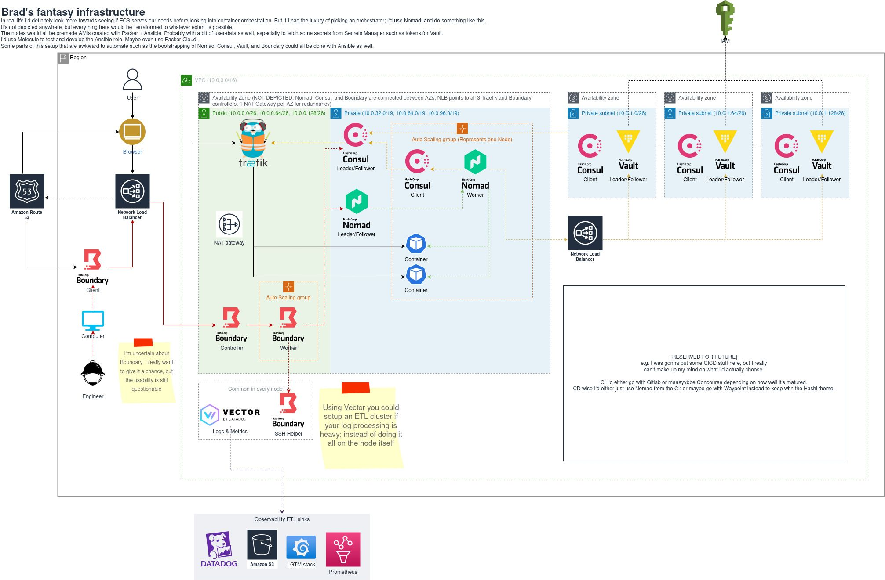

# Overview

This repo's main goal is to provide an easy, streamlined way of setting up a production ready single-region hashistack Cluster.

**Currently this repo is not production ready, and has large amounts of work left to do.** However if you're interested
in tinkering around with Nomad, Consul, and Boundary - then still feel free to give it a go.

Please note that due to this repo being early on in readiness, docs, code quality, and code documentation will all be severely lacking.

I am not accepting PRs currently as I really want to take a break from this project, and come back a bit later. Feel free to open issues though.

Also please note that, while I've tried to ensure that everything is region-independent, the only region I've developed and tested in so far is eu-west-1.

# Featuring

- Public NLB load balancing between dedicated Traefik hosts
- Traefik as the reverse proxy which is automatically configured to use Consul Catalog
- Highly-available Hashicorp Consul with ACL and automatic bootstrapping
- Highly-available Hashicorp Nomad with ACL and automatic bootstrapping
- Highly-available Hashicorp Boundary as the engineer entry point with automatic bootstrapping

# In the future

- Disaster Recovery Runbook and Automation (backups, etc.)
- Nomad, Consul, and Boundary server update Runbooks and Automation. Need to test how reliable I can make instance refreshes.
- Make the Terraform a bit more configurable from `cluster.yml` (e.g. right now every instance is always t4g.micro)
- Implement ASG autoscaling policies
- Observability. I want to use [Vector](https://vector.dev) and the LGTM (Loki, Grafana, Tempo, Mimir) stack.
- Nomad Autoscaler needs to be setup for horizontal scaling.
- Eventually support easy creation of multiple clusters, especially since Nomad and (I think) Consul support federation.
- High quality documentation and code comments.
- Implement a proper test strategy.
- Probably need to have separate servers for Consul and Nomad, instead of lumping them into the same instance.
- Getting Vault integrated would be really nice, but that's its own entire beast to maintain.
- (and likely so, so much more...)

# Architecture

**This is not the exact architecture**, but until I've reached a "v1.0" version of the repo I won't be remaking this diagram. It does give you the main idea of how its working though.



# Using this repo

You can find a short video of me using the repo [here](https://www.linkedin.com/feed/update/urn:li:ugcPost:7023719412788527105/).

Otherwise, here's a very quick and dirty list of what to do:

1. Open `cluster.yml` and setup the values as you'd like.
2. Ensure your `aws` CLI is configured, and you've set the target region (or use the `AWS_DEFAULT_REGION` env var).
3. Run `python3 scripts/create.py`.
4. Go through any prompts that appear.
5. After ~20 minutes of waiting (Packer is slow; RDS creation is slow) you should get a `CertificateNotFound` error. You'll need to go manually setup the DNS verification for the newly made ACM certificate.
6. Rerun the python script and wait another few minutes.
7. You will now have a bunch of credentials and a DNS record pop up. Follow the on screen text.
8. Download the Boundary Desktop Client and connect to your boundary interface (`https://boundary.[ROOT_DOMAIN_NAME]`).
9. You can then use the client to port forward into Nomad and Consul.

Note: The credentials are stored within AWS secrets manager, so can easily be managed.

# Debugging

TODO: Reminder that this is basically an alpha level repo right now.

# Exposing Services

As part of the "High Quality documentation" stage I'll be writing better info about this, but for now the steps look a little like this:

In your Nomad job file you need to add tags that Traefik understands:

```
"traefik.http.routers.A-Unique-Name-Here.rule=Host(`myservice.cluster.io`)",
"traefik.http.routers.A-Unique-Name-Here.tls=true",
```

Then you need to do normal DNS stuff and setup a CNAME to the NLB which matches the hostname you provided in the tag above.

You can of course do whatever Traefik itself allows you to do, but this is the most basic way to expose your Nomad services.
